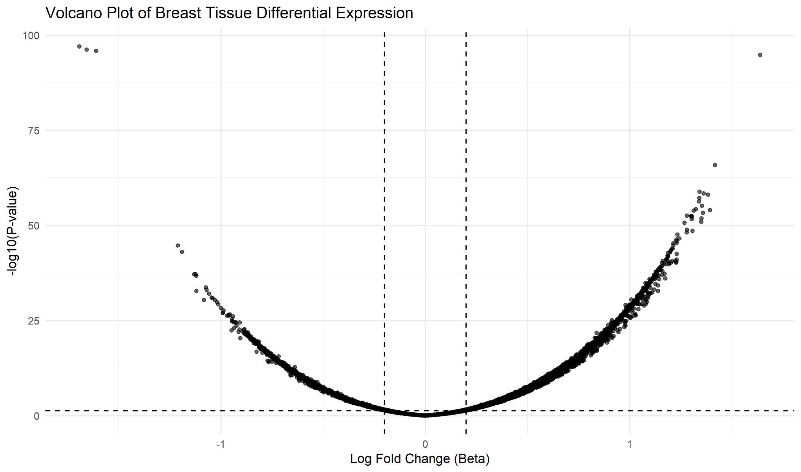
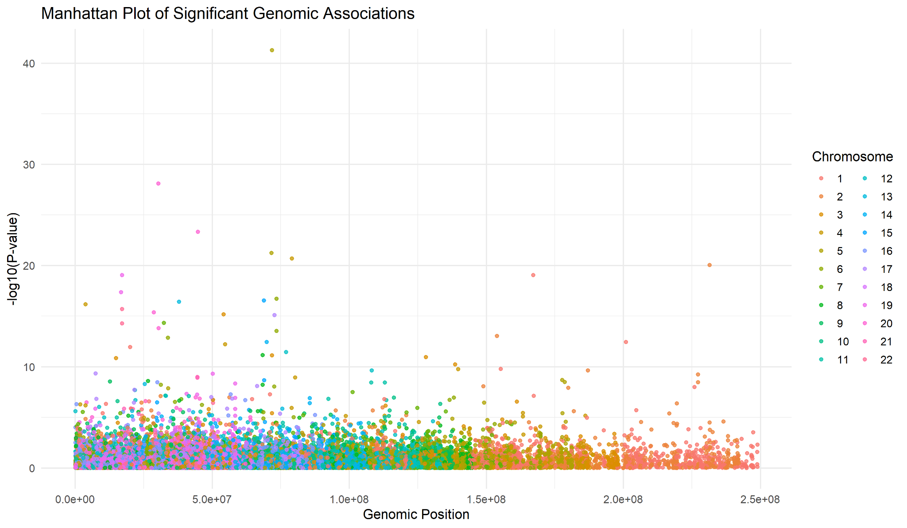
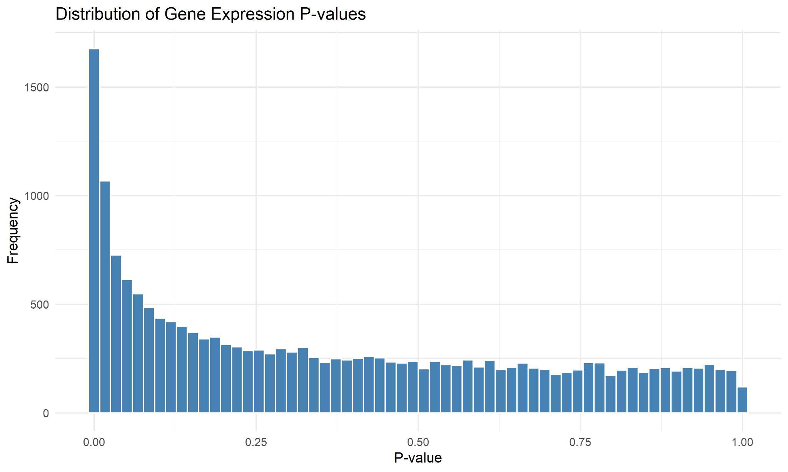
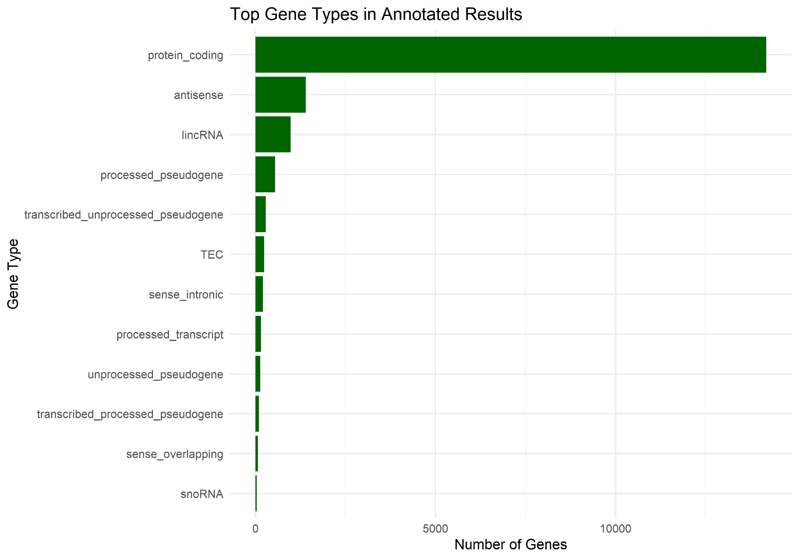
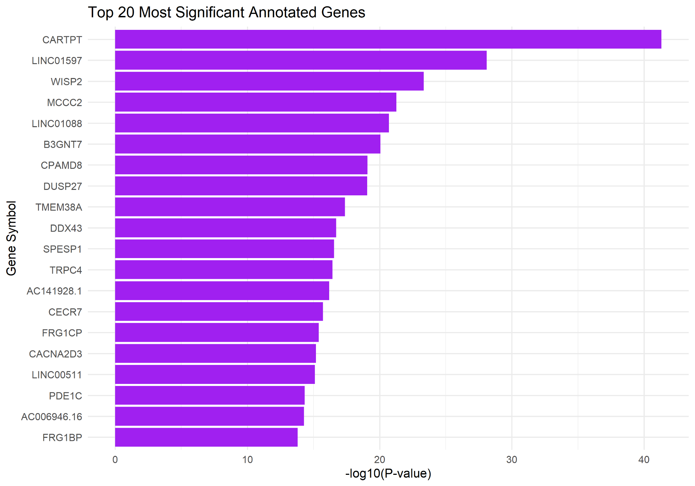
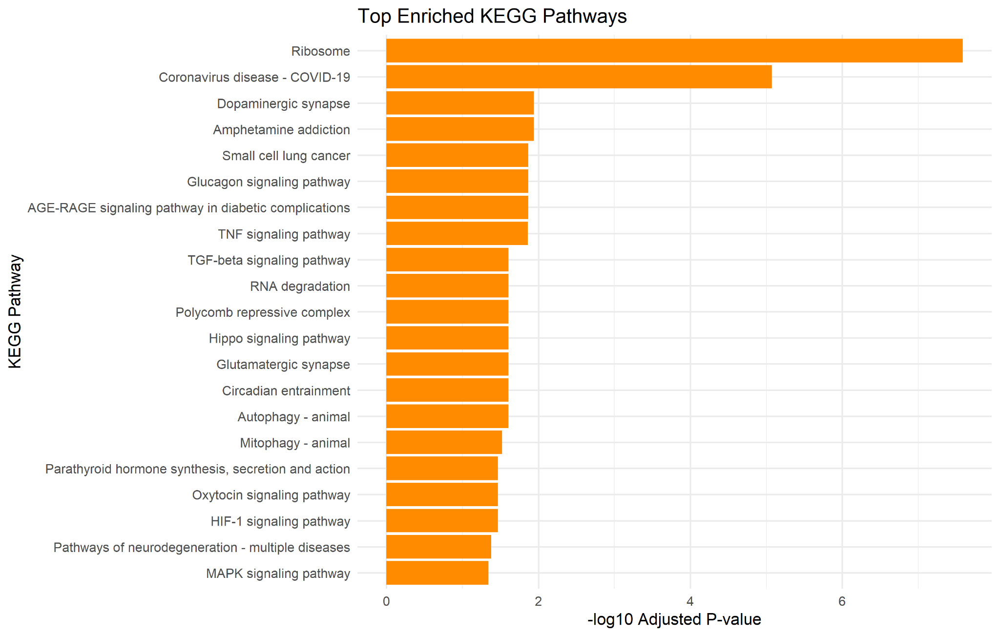

# GTEx Sex Differential Expression Analysis in R

## Portfolio Purpose

This repository presents an employer-facing data analyst / data scientist portfolio version of my MSc Health Data Science dissertation project at the University of Dundee.

The original study investigated whether sex-specific differences in gene expression across human tissues may help explain differences in disease prevalence, susceptibility or progression. This repository translates that research into a reproducible analytics case study showing data cleaning, statistical modelling, visualisation and interpretation skills using R.

## Project Summary

Using GTEx v8 transcriptomic data, I analysed sex-associated gene expression differences across three clinically relevant human tissues:

- **Aorta artery** - cardiovascular disease and atherosclerosis relevance
- **Breast mammary tissue** - breast cancer relevance
- **Brain hippocampus** - Alzheimer’s disease relevance

The analysis combined high-dimensional data processing, differential expression modelling, multiple testing correction, genome-wide visualisation, pathway enrichment and GWAS-linked interpretation.

## Key Project Metrics

| Metric | Value |
|---|---:|
| Aorta artery samples | 432 |
| Brain hippocampus samples | 197 |
| Breast mammary samples | 459 |
| Gene variables analysed | approximately 19,000+ per tissue |
| Aorta artery DEGs | 801 |
| Brain hippocampus DEGs | 13 |
| Breast mammary DEGs | 5,597 |
| Core tools | R, ggplot2, limma, biomaRt, DAVID/KEGG |

## Analytical Workflow

1. **Data acquisition**  
   GTEx v8 transcript-per-million expression data and phenotype/covariate metadata were prepared for analysis.

2. **Data cleaning and validation**  
   Sample identifiers were checked, cleaned and harmonised before tissue-level expression and phenotype tables were merged.

3. **Differential expression modelling**  
   Gene expression was modelled against biological sex to estimate effect size and statistical significance.

4. **Multiple testing correction**  
   Benjamini-Hochberg and Bonferroni methods were used to control false discovery and identify statistically meaningful genes.

5. **Visual analytics**  
   Volcano plots, Manhattan plots, p-value distributions and gene type charts were generated to communicate statistical signals.

6. **Pathway enrichment**  
   KEGG/DAVID pathway analysis was used to identify biological pathways enriched among differentially expressed genes.

7. **Disease relevance interpretation**  
   Results were compared with GWAS-linked disease genes to explore whether sex-biased expression signatures aligned with known disease-associated genes.

## Selected Visual Outputs

### Volcano Plot - Breast Mammary Tissue



### Manhattan Plot - Genome-wide Differential Expression Signal



### P-value Distribution



### Gene Type Distribution



### Top Significant Annotated Genes



### KEGG Pathway Enrichment



## Technical Skills Demonstrated

- High-dimensional transcriptomic data processing
- Multi-source data validation and merging
- Regression-based differential expression analysis
- Multiple testing correction
- Genome-wide statistical visualisation
- Pathway enrichment interpretation
- Reproducible R scripting
- Evidence-based analytical storytelling
- Translating complex scientific analysis into decision-oriented reporting

## Repository Structure

```text
gtex-sex-differential-expression-r/
├── README.md
├── index.html
├── gtex_differential_expression_analysis.R
├── GTEx_Sex_Differential_Expression_Technical_Summary.pdf
├── figures/
│   ├── 01_volcano_breast.png
│   ├── 02_manhattan_plot.png
│   ├── 03_pvalue_histogram.png
│   ├── 04_gene_type_distribution.png
│   ├── 05_top_significant_genes.png
│   └── 06_kegg_pathway_enrichment.png
└── results/
    ├── summary_metrics.csv
    ├── top_significant_genes_example.csv
    └── pathway_results_example.csv
```

## Important Note on Data

The repository is designed as a portfolio and reproducibility showcase. The large GTEx source data are not uploaded here due to size and governance considerations. The R script demonstrates the analysis workflow and can be adapted where GTEx input files are available.

## Professional Relevance

Although the project is genomic in subject matter, it demonstrates transferable analyst capability highly relevant to health, NHS and public sector data roles:

- processing large and complex datasets
- validating and merging records across sources
- applying statistical methods to answer defined analytical questions
- producing reproducible outputs
- communicating complex findings clearly to technical and non-technical audiences
